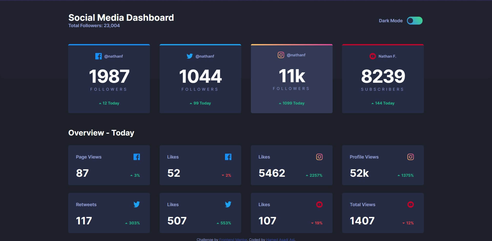

# Frontend Mentor - Social media dashboard with theme switcher solution

This is a solution to the [Social media dashboard with theme switcher challenge on Frontend Mentor](https://www.frontendmentor.io/challenges/social-media-dashboard-with-theme-switcher-6oY8ozp_H).

## Table of contents

- [Overview](#overview)
  - [The challenge](#the-challenge)
  - [Screenshot](#screenshot)
  - [Links](#links)
- [My process](#my-process)
  - [Built with](#built-with)
  - [What I learned](#what-i-learned)
  - [Useful resources](#useful-resources)
- [Author](#author)

## Overview

### The challenge

Users should be able to:

- View the optimal layout for the site depending on their device's screen size
- See hover states for all interactive elements on the page
- Toggle color theme to their preference

### Screenshot



### Links

- Live Site URL: [Social media dashboard (URL)](https://hamed3958.github.io/Social-media-dashboard/)

## My process

### Built with

- Semantic HTML5 markup
- CSS custom properties
- Flexbox
- CSS Grid

### What I learned

How to use border radius at linear-gradient background :

```css
.mid-box3 {
  overflow: hidden;
  position: relative;
}

.mid-box3 ::after {
  content: "";
  background: linear-gradient(230deg, #df4896 0%, #ee877e 50.91%, #fdc366 100%);
  height: 4px;
  position: absolute;
  top: 0px;
  right: 0;
  left: 0;
}
```

Dark mode in website and keep that while refreshing :

```js
const toggle = document.getElementById("toggle");
const body = document.querySelector("body");
const currentTheme = localStorage.getItem("theme");

if (currentTheme == "dark") {
  toggle.classList.add("active");
  body.classList.add("active");
}

toggle.onclick = function () {
  toggle.classList.toggle("active");
  body.classList.toggle("active");

  let theme = "light";
  if (body.classList.contains("active")) {
    theme = "dark";
  }

  localStorage.setItem("theme", theme);
};
```

Animated Number Counter :

```js
const counters = document.querySelectorAll(".value");
const speed = 72;

counters.forEach((counter) => {
  const update = () => {
    const target = +counter.getAttribute("targetNum");
    const data = +counter.innerText;

    const time = target / speed;
    if (data < target) {
      counter.innerText = Math.ceil(data + time);
      setTimeout(update, 1);
    } else {
      counter.innerText = target;
    }
  };

  update();
});
```

### Useful resources

I really liked these patterns and will use it going forward :

- [Radius at linear-gradient background](https://jsfiddle.net/devedoping/y9hb7f6u/) - This helped me for radius at linear-gradient background.

- [Transitioning Gradients](https://codepen.io/chriscoyier/pen/eRbLWP) - This helped me to transition a background gradient.

- [Animated Number Counter with Vanilla JavaScript](https://codepen.io/akhijannat/pen/JjYQgNK) - This helped me to count up numbers visually, on page load.

## Author

- Website - [hamedasadiasl.ir](http://hamedasadiasl.ir/)
- Github - [@hamed3958](https://github.com/hamed3958)
- Frontend Mentor - [@hamed3958](https://www.frontendmentor.io/profile/hamed3958)
